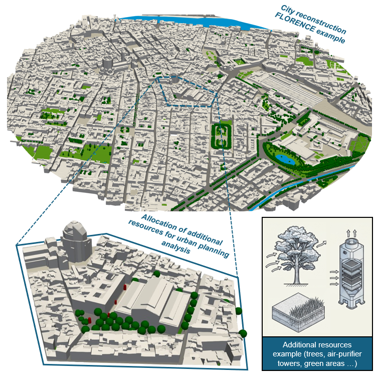

<table>
  <tr>
    <td>
      
    </td>
    <td>
      <h1>Cities reconstruction for urban planning analysis</h1>
    </td>
  </tr>
</table>

<p align="center">
    
</p>


## TODOs
- [ ] complete ongoing refactoring plan
- [ ] Choose and add the project license before public distribution.
- [ ] Configure City4CFD surface flattening for water surfaces.
- [ ] Decide how to handle outer domain: current path wants to include surface layers and building footprints in the outer domain without reconstructing any explicit feature, retaining the outer domain info so that they get implicitly considered in the OpenFOAM simulation via boundary conditions.
- [ ] Make `point-cloud` stage parallelisable
- [ ] Define stage for OpenFOAM test case preparation ready for meshing and running (`snappyHexMesh`-based grid and `URANS` modelling)

## Features
| stage name | current status |
| --- | --- |
| shapefiles | retrieval from OSM with user-defined features and from optional user provided shapefiles |
| point-cloud | from DTM/DSM to point-cloud conversion with shapefile alignment and projection and classification into buildings and ground points |
| city-models | 3D modelling via City4CFD from shapefiles and user configuration |
| trees | 3D modelling of trees from shapefiles, user configuration, and a user-provided tree-model library |
| air-purifiers | 3D modelling of air purifiers from shapefiles, user configuration, and a user-provided air-purifier-model library |

### Missing features and future work

#### Shapefiles retrieval
OSM and municipal open-data portals can contain incomplete or inconsistent feature classifications. Add reviewable segmentation procedures to propose missing features for the retrieved shapefiles.

Features that need to be addressed:
* trees
* green areas
... Everything else

#### Point-cloud processing
Starting from DSM and DTM (or point-clouds) we should be able to separate the point-cloud into different classes:
* buildings
* ground
* vegetation
* other features (like "unconventional", city4cfd speaking, structures like bridges, tunnels, overpasses, roofs etc.)

E.g.:
**roofs/underpasses** --> reconstruction is already supported by city4cfd, but an addtional paraemter is required, which is the distance between the local ground and the roof bottom. This distance must be associated with the tagged roof in `.json` buildings input file (for now all roofs minimum height falls back to the user-provided default value)

**tunnels** --> generally all info is in DSM/ground point-cloud. So whenever a tunnel is (e.g. road tagged in OSM as tunnel or with layer=-1) we should ... redefine surface layer as building with a minimum height to model it as an underpass --> issues: it cannot stays as a building because on top we might have a terrain layer and the floor of the tunnel has no data points. So we need to add points on the "interpolated" floor of the tunnel and we need only the building engine to create the tunnel geometry.

**bridges** --> from point cloud we need to understand the type of bridge and then rely on parametric model to be fitted to the point cloud (find the best scaled shaped that fit the data). Issues: we need to have a library of parametric models for bridges, and we need to understand the type of bridge from the point cloud and its connection with terrain. We need to allow for surface layer characterization on top of bridge structure (e.g. roads, paths, green areas, buildings, etc.)

#### Vegetation modelling
Current status consider a library of standardized tree models grouped by generic standard shapes.
No per-specie allometric equations are implemented.

For sure the library of parametric tree models needs improvements (in the geometry parameters and in the species-shapes association).

We could:

* Add allometric equations for each specie in the library to exploit the only data generally available from tree-surveys (Diameter at Breast Height, DBH) to scale the parametric models to the real trees --> issues: allometric equations are not available for all species, and not even DBH is always available in tree surveys.

* Exploit point cloud to scale parametric models to the real trees --> issues: almost no one perform surveys based on terrestrial laser scanning, we can exploit aerial laser scanning but I believe terrestrial laser scanning will be required for trees features extraction (for example to get the Leaf Area Density, LAD, of the trees).

! We do not have a solution to get the most important parameter for CFD modelling: LAD of trees. I believe it could only be done considering terrestrial laser scanning surveys.

This repository will build an application that reconstructs city geometry from online or user-provided data and prepares CFD-ready computational domains for OpenFOAM. The target workflow starts from a small TOML input file, retrieves and prepares geospatial data, reconstructs buildings and terrain through City4CFD, places parametric tree models, and prepares OpenFOAM mesh-generation inputs.

The current implementation provides configuration parsing, dependency-aware and single-stage CLI execution, example Florence configuration, executable feature-retrieval and maintained review-only visual-enrichment stages, supplemental municipal shapefile ingestion, externally authored mixed tree/air-purifier planning GeoJSON, City4CFD point-cloud preparation from DTM/DSM ASCII grids, a configurable City4CFD LoD2.2 reconstruction stage that runs `city4cfd` when available or falls back to Docker when needed, optional terrain sampling for parametric tree and air-purifier placement, executable tree and air-purifier geometry stages, offline graphical QA, and tests. It does not yet run a neural segmentation model or write OpenFOAM cases.

## Implementation Strategy

The project is organized as a set of small modules that match the intended computational workflow:

1. `shapefiles`: convert user inputs into Overpass queries, retrieve OSM features, integrate optional supplemental municipal shapefiles and external urban-planning points, partition all polygons by configurable precedence, split inner-region features from outer terrain features, and write GeoJSON plus source-aware previews.
2. `visual-enrichment` (deferred): ingest reviewable external segmentation polygons for candidate footprint and terrain-surface refinements.
3. `point_cloud`: generate separate City4CFD ground and building PLY point clouds from DTM/DSM rasters, project building footprints into the metric CRS, and write alignment diagnostics.
4. `city_models`: project stage-1 terrain categories into the City4CFD metric CRS, prepare a City4CFD LoD2.2 configuration and command script, run `city4cfd` when available or through Docker, and preserve buildings, residual terrain, and named semantic surface meshes in the manifest and graphical preview.
5. `trees` (incomplete): generate parametric trunk/crown STL surfaces from retrieved tree features and configured species equations.
6. `air_purifiers`: scale, rotate, terrain-project, and place normalized purifier points using exact `inlet`, `outlet`, and `tower` regions from the configured model catalog.
7. `openfoam`: isolate future OpenFOAM case generation and command planning.

External systems such as Overpass, City4CFD, and OpenFOAM are kept behind stage modules. This keeps the CLI and configuration layer testable while domain-specific adapters are added incrementally.

Stage packages preserve their established public entry points, including `plan()` and `run()` for executable stages, while implementation modules remain stage-internal. The shapefiles package delegates raw Overpass transport/cache handling, ESRI SHP/DBF decoding, and WMS evidence retrieval to `stages/shapefiles/inputs.py`; Overpass tag inventory, classification, payload-to-GeoJSON transformation, and shared local-polygon conversion to `stages/shapefiles/transformation.py`; supplemental ESRI validation, stage-local CRS conversion, record-to-feature transformation, and tree-attribute mapping to `stages/shapefiles/supplemental.py`; cross-source tree deduplication and configured polygon surface-precedence/overlap resolution to `stages/shapefiles/policy.py`; pure diagnostic summaries to `stages/shapefiles/diagnostics.py`; generated Markdown reports to `stages/shapefiles/reporting.py`; self-contained HTML/SVG feedback to `stages/shapefiles/rendering.py`; and ordered artifact assembly plus manifest-last publication to `stages/shapefiles/publication.py`. Orchestration and artifact file writes remain in `stages/shapefiles/stage.py`. Supplemental tree mappings are centralized in `TREE_ATTRIBUTE_MAPPINGS`: adding a recognized alias group does not require changing the record conversion flow, while every original DBF field remains available under `source_attributes` even when it has no normalized tree tag. Metric mappings recognize `mm`, `cm`, or `m` either in the value (for example, `32 cm`) or in the matched attribute name (for example, `dbh_cm`). Explicit declarations must agree; otherwise the derived metric tag is omitted. Unitless diameter/DBH values follow the standard mapping default of centimetres, while circumference and other metric values default to metres. No magnitude-based unit guessing is used.

`StageId` provides stable stage identity independently of presentation order. The dependency-neutral stage-layout catalogue stores only each identity and sequence number; its `number_name` property composes directory names such as `03_point_cloud` from those two values. `StageSpec` adds maturity, automatic-selection policy, dependencies, inputs, planners, and execution adapters without duplicating layout metadata. The CLI derives executable choices, dependency-aware `run` plans, and `run-stage` dispatch from that registry; stage-specific CLI overrides are applied by the focused runtime adapters in `stage_runtime.py`.

The point-cloud package delegates building-footprint GeoJSON reading, canopy PNG decoding, and paired ESRI ASCII-grid discovery/parsing to `stages/point_cloud/inputs.py`; projected-polygon predicates, spatial indexing, DTM/DSM scanning, and building/tree/unclassified point classification to `stages/point_cloud/geometry.py`; alignment status, shift scoring, and the complete diagnostics payload to `stages/point_cloud/diagnostics.py`; Markdown generation to `stages/point_cloud/reporting.py`; and self-contained HTML plus browser scene-data preparation to `stages/point_cloud/rendering.py`. `stages/point_cloud/stage.py` retains input-policy validation and handoff selection, CRS projection, artifact writes, manifest publication, and its public `plan()`/`run()` facade.

### Current Stage Status

Bare `run` executes the implemented core reconstruction chain `shapefiles -> point-cloud -> city-models`. Air-purifier placement remains an optional branch selected with `--include air-purifiers`; review-only visual enrichment, incomplete trees, and planned OpenFOAM work never enter a default run. `run --target <stage>` resolves only that executable stage and its required dependency closure, while `run-stage` remains available when no upstream stages should be planned automatically. The registry distinguishes a hard dependency from a default artifact producer, so a user-provided input can replace a normal upstream handoff where documented.

| Stage | Status | Required inputs and normal producer | Supported input override | Output directory |
| --- | --- | --- | --- | --- |
| `shapefiles` | `implemented` | Region and classification configuration; Overpass and configured local inputs | `--overpass-json` plus documented supplemental-file overrides | `01_shapefiles` |
| `visual-enrichment` | `review_only` | Stage 1 `all_features.geojson`; external candidates are optional | `--segmentation-geojson`, `--sat2lod2-geojson` | `02_visual_enrichment` |
| `point-cloud` | `implemented` | Paired DTM/DSM grids and building-footprint GeoJSON; Stage 1 is only the default footprint producer | `--building-footprints-geojson`, `--tree-canopy-overlay` | `03_point_cloud` |
| `city-models` | `implemented` | Stage 1 semantic surfaces and the completed point-cloud manifest | Documented `--city-models-*` parameters | `04_city_models` |
| `trees` | `incomplete` | Stage 1 tree features and the configured tree model library | `--tree-terrain-geometry` for optional terrain placement | `05_trees` |
| `air-purifiers` | `implemented` | Stage 1 purifier features and a purifier model catalog | `--model-library`, `--terrain-geometry` | `06_air_purifiers` |
| `openfoam` | `planned` | Planned handoff from city, tree, and purifier geometry | None; execution is not implemented | `07_openfoam` (planned) |

Point-cloud generation does **not** unconditionally depend on running `shapefiles`. It requires building footprints, but `--building-footprints-geojson` can provide them directly. When canopy filtering is enabled, the named `category-trees` handoff from a valid completed Stage 1 manifest supplies optional nearby tree-tag evidence. A missing, failed, or incomplete Stage 1 run produces no tree-tag points when explicit footprints are used; loose `01_shapefiles/trees.geojson` data is never trusted by itself.

### Runtime Stage Contract

Every completed executable stage atomically writes `<stage-output-directory>/manifest.json` last, after its artifacts, report, and graphical preview. The common manifest uses schema version `2` and records the stage, terminal status, provenance, typed artifact references, metrics, and stage-specific details. Schema 2 is intentionally incompatible with the earlier stage-specific manifests: rerun each affected stage before using its outputs downstream; legacy manifests are neither loaded nor translated.

A missing `manifest.json` means the run is incomplete, interrupted, or invalid, so any files beside it are not a trusted handoff. The terminal status `completed` identifies a usable result after required-artifact validation. `failed_external_execution` preserves reports, logs, and diagnostics from an external-tool failure, but it is not a usable downstream handoff. Consumers require the expected producer stage, schema 2, `completed` status, and all required artifacts.

Loaded manifests are bound to their publication location: the declared manifest path must resolve to the file being loaded, the output directory must resolve to its parent, and every report, preview, and artifact path must resolve beneath that stage-owned directory. Relocated manifests, `..` escapes, and symlinks escaping the stage directory are rejected.

For `run-stage`, exit code `0` means completed, `1` means a terminal execution failure such as `failed_external_execution`, and `2` means a CLI-usage or configuration error. `run` uses the same codes across its aggregate: it prints the resolved plan before external work, stops after the first non-completed result, and returns `0` only when every planned stage completed. Point-cloud preparation always requires building footprints, but `shapefiles` is only their default producer: `--building-footprints-geojson` can supply an accepted file directly. For example, targeting point-cloud with that override runs point-cloud alone; a default core run still needs shapefiles independently for city-model semantic surfaces.

## Deferred Development Routes

### Segmentation-Assisted Visual Enrichment

The visual-enrichment implementation is segmentation based, not a deterministic color-threshold parser. The current executable stage ingests segmentation polygons from an external backend as GeoJSON, uses available orthophotos/aerial images as provenance when stage-1 imagery diagnostics are available, and creates reviewable candidate layers that improve the stage-1 OSM retrieval without silently changing authoritative geometry.

The intended aims are:

- refine building footprints from imagery, especially where OSM footprints are too simple for LOD 2.2 reconstruction
- preserve complex building outlines, courtyards, wings, roof regions, and other footprint details that can help later City4CFD/LOD 2.2 preparation
- improve terrain-surface classification by proposing better tags for unclassified or weakly classified polygons
- improve detection of roads, asphalt, paved surfaces, and concrete surfaces where OSM lines or tags are insufficient for surface reconstruction
- produce graphical overlays and organized diagnostics comparing OSM polygons, segmentation masks, candidate polygons, confidence, and provenance

The route stays conservative: segmentation-derived geometry is written as candidate data with source image, model/backend name, confidence, suggested target category, and `review_status=needs_review`. It is not mixed into `01_shapefiles/all_features.geojson` or downstream reconstruction inputs until a review/acceptance workflow promotes it. The stage writes `02_visual_enrichment/enriched_all_features.geojson` as a review artifact that combines stage-1 features with proposed candidate changes.

Possible open routes to evaluate include general segmentation models such as Segment Anything-style backends for mask proposal, remote-sensing semantic segmentation models for land-cover classes, and building-footprint extraction models trained on aerial/satellite imagery. SAT2LoD2 / `GDAOSU/LOD2BuildingModel` is supported only as an optional external adapter for user-provided 2D building polygons. The project still needs a permissive backend choice, model weights, licensing review, confidence calibration, and a reproducible acceptance workflow before candidates can be promoted automatically.

### SAT2LoD2 / LOD2BuildingModel

SAT2LoD2 / `GDAOSU/LOD2BuildingModel` is a relevant possible route for future building reconstruction. It targets automated LoD-2 building model reconstruction from satellite-derived DSM and orthophoto inputs, including building detection, footprint polygon extraction, rectangle decomposition, orientation refinement, and 3D model fitting. This overlaps well with the project's long-term need to move from footprints and raster inputs to LoD-2-ready building geometry.

This route is implemented only as an external adapter. The repository license/EULA for SAT2LoD2 appears to restrict use to internal, non-commercial purposes and disallows distribution and derivative works, so this project does not vendor or modify that code. The adapter writes a handoff manifest with available orthophoto/ROI context, then imports user-provided SAT2LoD2 2D building polygon GeoJSON as review-gated `candidate_building_footprints.geojson` records with provenance.

## Project Structure

```text
.
├── config/
│   └── examples/
│       └── florence.toml
├── docs/
│   └── assets/
├── src/
│   └── cities_reconstruction/
│       ├── cli.py
│       ├── config.py
│       ├── artifacts.py
│       ├── adapters/
│       ├── geometry/
│       ├── pipeline.py
│       ├── pipeline_execution.py
│       ├── stage_layout.py
│       ├── stage_runtime.py
│       └── stages/
│           ├── __init__.py
│           ├── air_purifiers/
│           │   ├── __init__.py
│           │   └── stage.py
│           ├── city_models/
│           │   ├── __init__.py
│           │   └── stage.py
│           ├── openfoam/
│           │   ├── __init__.py
│           │   └── stage.py
│           ├── point_cloud/
│           │   ├── __init__.py
│           │   ├── diagnostics.py
│           │   ├── geometry.py
│           │   ├── inputs.py
│           │   ├── stage.py
│           │   ├── rendering.py
│           │   └── reporting.py
│           ├── shapefiles/
│           │   ├── __init__.py
│           │   ├── stage.py
│           │   ├── diagnostics.py
│           │   ├── inputs.py
│           │   ├── policy.py
│           │   ├── publication.py
│           │   ├── rendering.py
│           │   ├── reporting.py
│           │   ├── supplemental.py
│           │   └── transformation.py
│           ├── trees/
│           │   ├── __init__.py
│           │   └── stage.py
│           └── visual_enrichment/
│               ├── __init__.py
│               └── stage.py
├── tools/
│   └── build_air_purifier_tower_models.py
└── tests/
```

## Installation

Install `uv`, then create the project environment from the repository root:

```bash
uv sync
```

Run the test suite:

```bash
uv run pytest
```

New tests should use `pytest` fixtures and assertions. `uv run pytest` is the project-standard test command.

Run the incremental Python quality checks:

```bash
uv run ruff check
uv run mypy
uv run pytest -q --cov=cities_reconstruction --cov-report=term-missing
```

Ruff and mypy initially cover the pipeline, CLI, runtime-adapter, artifact, stage-result, and City4CFD adapter boundaries plus their focused tests. This scope is intentionally expanded as the larger stage modules are decomposed; coverage measures the complete `cities_reconstruction` package and enforces the configured baseline.

## Usage

Every CLI command requires an explicit `--config` / `-c` TOML path. The CLI never loads `config/examples/florence.toml` implicitly. That Florence file is the runnable, fully annotated reference for every currently supported TOML parameter, including commented optional alternatives and conditional usage notes.

Validate a configuration file:

```bash
uv run cities-reconstruction validate-config --config config/examples/florence.toml
```

Show the planned dry-run pipeline:

```bash
uv run cities-reconstruction dry-run --config config/examples/florence.toml
```

Show one stage only:

```bash
uv run cities-reconstruction dry-run --config config/examples/florence.toml --stage shapefiles
```

Run the implemented core reconstruction chain in dependency order:

```bash
uv run cities-reconstruction run --config config/examples/florence.toml
```

Add the optional air-purifier branch to the core run:

```bash
uv run cities-reconstruction run --config config/examples/florence.toml --include air-purifiers
```

Run only point-cloud and its normal required producer:

```bash
uv run cities-reconstruction run --config config/examples/florence.toml --target point-cloud
```

Replace that default producer with an explicitly accepted footprint file. In
this targeted form the resolved plan contains only point-cloud:

```bash
uv run cities-reconstruction run --config config/examples/florence.toml \
  --target point-cloud \
  --building-footprints-geojson path/to/accepted_buildings.geojson
```

Add `--json` to emit one aggregate object containing the resolved `plan` and
the `results` actually produced. The same plan is written to standard error
before execution so standard output remains valid JSON. Human output prints the
plan first and then each produced stage report.

Run the first stage against Overpass:

```bash
uv run cities-reconstruction run-stage --config config/examples/florence.toml shapefiles
```

Run the first stage from a cached Overpass JSON response:

```bash
uv run cities-reconstruction run-stage --config config/examples/florence.toml shapefiles --overpass-json path/to/overpass_raw.json
```

Run review-gated visual enrichment after the first stage has produced `01_shapefiles` outputs:

```bash
uv run cities-reconstruction run-stage --config config/examples/florence.toml visual-enrichment
```

Run visual enrichment from a specific external segmentation GeoJSON:

```bash
uv run cities-reconstruction run-stage --config config/examples/florence.toml visual-enrichment --segmentation-geojson path/to/segmentation.geojson
```

Run visual enrichment from SAT2LoD2 / `GDAOSU/LOD2BuildingModel` 2D polygon output:

```bash
uv run cities-reconstruction run-stage --config config/examples/florence.toml visual-enrichment --sat2lod2-geojson path/to/sat2lod2_building_polygons.geojson
```

Prepare City4CFD point-cloud inputs after building footprints exist:

```bash
uv run cities-reconstruction run-stage --config config/examples/florence.toml point-cloud
```

Prepare point-cloud inputs with a user-provided tree-canopy overlay image for optional tree DSM filtering:

```bash
uv run cities-reconstruction run-stage --config config/examples/florence.toml point-cloud --tree-canopy-overlay path/to/overlay.png
```

Override Stage 1 building footprints explicitly for one point-cloud experiment. Relative paths are resolved from the selected configuration file's directory:

```bash
uv run cities-reconstruction run-stage --config config/examples/florence.toml point-cloud --building-footprints-geojson path/to/accepted_buildings.geojson
```

Prepare the City4CFD LoD2.2 reconstruction handoff after point-cloud preparation:

```bash
uv run cities-reconstruction run-stage --config config/examples/florence.toml city-models
```

Override `city_models` parameters from the command line when needed:

```bash
uv run cities-reconstruction run-stage --config config/examples/florence.toml city-models --city-models-top-height 350 --city-models-flow-direction 1 0 --no-city-models-reconstruct-boundaries
```

Generate parametric tree STL models after feature retrieval:

```bash
uv run cities-reconstruction run-stage --config config/examples/florence.toml trees
```

Override `inputs.tree_terrain_geometry_path` for one tree-generation run with a user-provided OBJ or ASCII STL in the local City4CFD coordinate frame:

```bash
uv run cities-reconstruction run-stage --config config/examples/florence.toml trees --tree-terrain-geometry path/to/terrain.obj
```

Relative terrain-geometry arguments are resolved from the directory containing the selected config file. Tree bases use an exact vertical terrain intersection where available; for internal holes in a supplied terrain mesh, the closest terrain-triangle boundary supplies the local elevation. Tree points outside the terrain extent remain an error.

Place air-purifier models after Stage 1 has written `01_shapefiles/air_purifiers.geojson`:

```bash
uv run cities-reconstruction run-stage --config config/examples/florence.toml air-purifiers
```

Override the model catalog and optional terrain geometry for one invocation. Both relative paths resolve from the selected configuration file's directory, and these options are rejected for every other stage:

```bash
uv run cities-reconstruction run-stage --config path/to/config.toml air-purifiers \
  --model-library path/to/parameters.json \
  --terrain-geometry path/to/terrain.obj
```

The effective model-library precedence is `--model-library`, then `[air_purifiers].model_library_path`; execution fails if neither resolves. Terrain uses the same precedence for `--terrain-geometry` and `[air_purifiers].terrain_geometry_path`, but unresolved terrain is valid and places every model base at `z=0`.

When City4CFD emits terrain and semantic `SurfaceLayer` meshes separately, `city-models` also writes `<output_file_name>_Terrain_Combined.obj`. This single terrain-only OBJ contains the residual terrain plus roads, green areas, concrete, water, and other terrain surfaces; buildings, top, and side boundary meshes are excluded.

Emit machine-readable dry-run output:

```bash
uv run cities-reconstruction dry-run --config config/examples/florence.toml --json
```

## Configuration

Configuration files are TOML. Relative paths are resolved from the directory that contains the configuration file. The CLI requires an explicit `--config` path and validates the file strictly before running any stage. Missing required values and unknown keys at the root, fixed-schema tables, or repeated configuration tables are configuration errors rather than silently ignored input; they make the command exit with code `2`. Use `uv run cities-reconstruction validate-config --config path/to/config.toml` to check a file before running stages. The default Florence example uses EPSG:25832 and points to the DTM and DSM assets already present under `docs/assets`.

The pipeline currently validates:

- region name, CRS, center latitude, and center longitude
- a positive outer diameter and, when provided, a positive inner diameter not larger than the outer diameter
- required `[inputs]`, `[shapefiles]`, `[trees]`, `[city_models]`, `[city_models.smooth_terrain]`, `[city_models.reconstruction_region]`, `[city_models.filters]`, `[imagery]`, and `[output]` tables
- required input workflow parameters, including Overpass URL, Overpass timeout, and tree overlap tolerance; optional `inputs.overpass_max_attempts` and `inputs.overpass_retry_backoff_s` default to three total attempts and a two-second initial delay
- at least one ordered `[[shapefiles.classification_rules]]` table, with a supported output `category`, a non-empty `group_tag`, and one or more `match_any` OSM tag expressions
- zero or more uniquely named `[[shapefiles.supplemental]]` municipal ESRI shapefiles with required path, CRS, and existing-data category; `group_tag` is required for every non-tree category and prohibited for trees, while `enabled` is optional
- zero or more uniquely named `[[urban_planning.inputs]]` externally authored mixed Point GeoJSON files in `EPSG:4326` or `EPSG:3857`
- an optional `[air_purifiers]` table containing config-relative `model_library_path` and `terrain_geometry_path`; both may be omitted at config-load time because the executable stage accepts one-run CLI overrides, while the model library remains required at stage execution
- a `shapefiles.surface_precedence` list with a category-wide fallback for each polygon category actually used by `[[shapefiles.classification_rules]]`; unused supported categories need not be listed, and a named supplemental surface can instead be covered by its declared `supplemental:name` entry
- optional input paths for point-cloud, DTM, DSM, tree-canopy overlay image data, and tree terrain geometry
- required `trees.default`, model library path, and species-category mapping path
- explicitly configured WMS imagery sources for diagnostic overlays, or `sources = []` when no imagery source should be used
- required `city_models` parameters for the City4CFD handoff, including documented LOD (`1.2`, `1.3`, or `2.2`), BPG boundary (`Rectangle`, `Round`, or `Oval`), and output-format (`obj`, `stl`, or `cityjson`) values; finite numeric values; positive geometric/filter/smoothing sizes; inclusive 0-100 thinning and building percentiles; inclusive 0-1 reconstruction complexity; non-negative `building=roof` base clearance; plain output/log filenames without directory separators; and a non-empty Docker image that does not begin with `-`. `buffer_region` may be negative, zero, or positive because it contracts, disables, or extends the buffer. Flow direction must be finite and nonzero when required by Rectangle/Oval domains or a Round domain with blockage-ratio handling. Optional `city_models.domain_bnd` is a positive radius in metres and is written directly to City4CFD, while omitting it retains City4CFD's automatic BPG boundary; `city_models.docker_image` remains optional because the runtime can also use `CITY4CFD_DOCKER_IMAGE`
- output root directory

TOML values and the complete effective set of `--city-models-*` overrides pass through the same validator and produce the same field-specific errors. Invalid post-override configuration exits with code `2` before the stage starts. Repository code that constructs a modified `AppConfig` programmatically must call `validate_config` before using it; the built-in CLI override helper already returns a validated configuration.

`region.inner_diameter_m` is optional. Omit it when every feature inside `region.outer_diameter_m` should receive the same treatment. In that uniform mode, stage 1 assigns `roi_zone=full`, marks every building in the outer ROI with `reconstruction_scope=primary_roi` and `include_in_building_lod22_reconstruction=true`, and writes `full_region.geojson`. Providing `inner_diameter_m` explicitly enables the two-zone policy described below; equal inner and outer values are not a sentinel for uniform treatment.

Stage 1 associates retrieved OSM tags with named output categories through the ordered `[[shapefiles.classification_rules]]` tables. Rules are evaluated from top to bottom and the first match wins, making table order the category-precedence policy. Each rule supplies a supported `category` (`buildings`, `roads`, `green_areas`, `concrete`, `water`, `trees`, or `other_terrain`), the `group_tag` written to GeoJSON, and a `match_any` list. An expression such as `"highway"` matches that key with any value; `"highway=pedestrian"` matches only the exact key-value pair. Put narrow exact-value rules before broad key-only rules. The Florence example contains the former built-in behavior as editable TOML data. Applied rules are copied into Stage 1 `summary.json` and `report.md` so each run records its classification contract. These rules classify Overpass data; municipal shapefiles use their explicit `[[shapefiles.supplemental]]` entries.

After classification and supplemental-input integration, Stage 1 makes every contributing polygon mutually disjoint using `shapefiles.surface_precedence`. Each polygon is clipped against the accumulated higher- or equal-priority coverage; a fully covered lower-priority polygon is removed. Entries may name a category, target `category:group_tag`, or target one declared source as `supplemental:name`. For each feature, Stage 1 selects the most-specific entry present—named supplemental source first, then category/group, then category fallback—and its position in the list determines priority. A category-wide fallback is required only when that polygon category appears in `[[shapefiles.classification_rules]]`; an enabled supplemental surface must be covered by either its source selector or its category fallback. Within the same precedence entry, stable Stage 1 feature order decides which coincident feature retains the shared area. Lines and points are reference-only and are not clipped. The applied policy, per-category and per-supplemental-source counts, clipped/removed feature counts, and removed overlap area are written to `summary.json` and `report.md`.

### Existing-data supplemental shapefiles

Use `[[shapefiles.supplemental]]` only for municipal datasets that complete existing OSM information. Surface categories require Polygon/MultiPolygon records; `category = "trees"` requires Point/MultiPoint records. `name`, `path`, `crs`, and `category` are required, names are unique, and `enabled` defaults to `true`. `group_tag` is required for every non-tree category and is prohibited when `category = "trees"`.

```toml
[[shapefiles.supplemental]]
name = "florence_streets"
path = "../data/street_areas.shp"
crs = "EPSG:3003"
category = "roads"
group_tag = "roads"
enabled = true

[[shapefiles.supplemental]]
name = "florence_tree_inventory"
path = "../data/trees.shp"
crs = "EPSG:3003"
category = "trees"
```

Paths are config-relative. Supported supplemental CRSs are `EPSG:4326`, `EPSG:25832`, and `EPSG:3003`. Stage 1 transforms and clips enabled inputs to the circular outer ROI, preserves DBF attributes and source provenance, and writes them into the selected existing-data category. Add `supplemental:florence_streets` to `surface_precedence` for source-specific priority. Supplemental tree points take precedence over nearby duplicate OSM tree nodes using `inputs.tree_overlap_tolerance_m`; set the tolerance to `0` to disable this overlap removal.

EPSG:3003 input is transformed with the Monte Mario / Italy zone 1 projection and its Rome40-to-WGS84 seven-parameter datum shift, matching the bundled Florence tree `.prj`. The Florence example uses `docs/assets/data/florence_opendata/trees_diameter/trees.shp`, whose DBF stores derived `DIAMETER_M` values. Stage 1 imports available species, genus, height, diameter/DBH, and circumference fields and preserves the raw DBF fields in `source_attributes` for review.

### Externally authored urban-planning GeoJSON

Urban planning is a separate input contract. Add any number of externally authored mixed Point GeoJSON files; enabled inputs are combined additively, input names are unique, and feature IDs must be globally unique across every input and both asset kinds. `crs` accepts `EPSG:4326` or `EPSG:3857` and defaults to `EPSG:4326`.

```toml
[[urban_planning.inputs]]
name = "mercato_centrale"
path = "../data/urban_planning/mercato_centrale/urban_plan.geojson"
enabled = true
# crs = "EPSG:4326"

[[urban_planning.inputs]]
name = "web_mercator_scenario"
path = "../data/urban_planning/alternative.geojson"
crs = "EPSG:3857"

[air_purifiers]
model_library_path = "../models/parameters.json"
# terrain_geometry_path = "../outputs/04_city_models/city4cfd_output/Mesh_Terrain_Combined.obj"
```

Each file is one GeoJSON `FeatureCollection`. Every feature requires a two-dimensional finite Point, a safe `properties.id`, `properties.kind` equal to `tree` or `air_purifier`, and an exact internal parametric `properties.model` name. EPSG:4326 coordinates use `[longitude, latitude]`; EPSG:3857 coordinates use Web Mercator `[x, y]` metres. Stage 1 normalizes both to EPSG:4326.

```json
{
  "type": "FeatureCollection",
  "features": [
    {
      "type": "Feature",
      "geometry": {"type": "Point", "coordinates": [11.2535, 43.7767]},
      "properties": {
        "id": "TREE-001",
        "kind": "tree",
        "model": "large_round_broadleaf",
        "height_m": 12.0,
        "crown_diameter_m": 6.0,
        "trunk_diameter_m": 0.24,
        "street": "Via Roma"
      }
    },
    {
      "type": "Feature",
      "geometry": {"type": "Point", "coordinates": [11.2537, 43.7768]},
      "properties": {
        "id": "AP-001",
        "kind": "air_purifier",
        "model": "compact_octagonal_tower",
        "height_m": 4.2,
        "width_m": 1.5,
        "depth_m": 1.4,
        "rotation_deg": 15.0,
        "notes": "externally reviewed position"
      }
    }
  ]
}
```

Tree dimensions are optional positive finite metre values: `height_m`, `crown_diameter_m`, and `trunk_diameter_m`. Purifier dimensions are optional positive finite `height_m`, `width_m`, and `depth_m`; finite `rotation_deg` is counter-clockwise around +Z and defaults to zero. These are exact per-kind allowlists: cross-kind modelling fields, unsupported dimension aliases, any unknown property ending in `_m`, and any unknown property beginning with `rotation` are rejected. The `kind` value itself must be exactly lowercase `tree` or `air_purifier`. Missing dimensions use the selected model defaults. Planned trees select `model` directly and bypass species/category mapping. Purifier names are validated in Stage 1 when `[air_purifiers].model_library_path` is configured; otherwise exact validation is deferred so `run-stage air-purifiers --model-library ...` can supply a catalog. Other JSON-safe properties are retained as provenance.

Stage 1 clips planning points to the outer ROI and writes normalized accepted points to `urban_planning.geojson`, routes planned trees to `trees.geojson`, and routes purifiers to `air_purifiers.geojson`. It records `urban_planning_input_id`, source CRS, source feature index, and preserved source properties. Outside-ROI points are valid but reported as excluded; `summary.json` and `report.md` retain each excluded record's input, feature index, ID, kind, normalized coordinates, and ROI distance. Planning points also appear in all-feature/non-contributing QA artifacts without becoming terrain polygons.

The Stage 1 preview distinguishes OSM/supplemental existing trees from planned trees, shows one `Accepted air purifiers` class, and provides controls by planning input and asset kind. Diagnostics name the planning input and feature index/ID. Every planning feature is implicitly planned; there is no purifier status field, counter, or control. Placement suitability remains external: this application does not optimize or audit spacing, street containment, building clearance, tree clearance, or any other planning constraint.

The core `air_purifiers.run(...)` stage consumes only the normalized `01_shapefiles/air_purifiers.geojson`. It validates identity and provenance, retains normalized EPSG:4326 source coordinates alongside projected/local coordinates, resolves model defaults and overrides, applies anisotropic scaling and counter-clockwise +Z rotation, and translates each model into the same local EPSG:25832 frame as City4CFD and trees. With terrain configured, all four rotated footprint corners must be inside its extent before sampling; without terrain, bases use `z=0`.

Successful generation writes `06_air_purifiers/air_purifier_placements.geojson`, `air_purifier_models_report.md`, an offline interactive `air_purifier_models_preview.html`, a combined three-region STL, one safe-ID STL per unit, and the canonical `manifest.json` as the final completion marker. Every STL preserves exact non-empty `inlet`, `outlet`, and `tower` regions. The preview renders those transformed patch triangles in blue, red, and grey and provides orbit, zoom, reset, model, and instance controls. Reports count models, source inputs, and parameter provenance. The stage is registered after `trees` and before `openfoam` and is executable through `run-stage air-purifiers`.

`trees.model_library_path` points to a JSON parametric tree model catalog, and `trees.category_mapping_path` points to a JSON file with `species_to_category` mappings. The Florence example uses `docs/assets/tree_models/categories/tree_categories.json` plus `docs/assets/data/florence_opendata/trees_diameter/species_category_mapping.json`. Existing OSM and supplemental trees use species/category mapping and the current allometric/default rules. Urban-planning trees instead use their exact internal `model` directly and apply any planned dimension overrides. Missing dimensions keep the selected category model defaults. The small idealised category library includes large and small round broadleaf, pyramidal and columnar conifer, umbrella pine, palm tuft, fastigiate broadleaf, and weeping broadleaf models. These are base CFD/QA assets, not botanical-detail meshes. The tree preview recenters its camera on generated instances for review, while exported placements and STL surfaces keep the configured projected origin used to align with City4CFD output.

The source category folder also includes `category_models_preview.html` for a 3D review of all category OBJ models and `category_model_catalog.md` for category parameters, mapped species, and the DBH scaling equations used by the current tree stage. In the category preview, each species name can be clicked to fetch up to three online reference images with source links for visual verification. Exact binomial species first use Wikidata scientific-name taxa and Wikimedia Commons taxon categories; genus-only and `spp.` source values are labelled as broader references. Regenerate both artifacts with `python3 tools/build_tree_category_catalog.py`.

The Florence example configures two Regione Toscana Geoscopio WMS diagnostic sources: the OFC_RT 2024-2025 orthophoto layer and the FOTOTECA 2024-2025 aerial-image layer. The `shapefiles` stage uses these images for diagnostic overlays. The `visual-enrichment` stage reuses fetched imagery diagnostics as provenance for external segmentation masks and for graphical candidate overlays.

All HTML graphical feedback artifacts include zoom controls. Use the mouse wheel over the plot or the `Zoom in`, `Zoom out`, and `Reset zoom` buttons to inspect details in SVG previews, imagery overlays, point-cloud previews, City4CFD previews, and tree-model previews. In Stage 1 `preview.html` and `imagery_overlay.html`, category rows toggle complete feature classes. Tree source rows distinguish Overpass, supplemental existing trees, planned trees, and removed duplicates; planning inputs and asset kinds have independent controls. Category and source visibility compose, so restoring a source does not show it while its parent category remains disabled.

## Stage 1 Outputs

The `shapefiles` stage currently writes outputs under `<output.root_directory>/01_shapefiles`:

- `tag_inventory_query.txt`: the first Overpass query, used to ask which OSM tags are available in the outer ROI
- `tag_inventory_raw.json`: the raw response for the tag inventory query
- `tag_inventory.json`: complete OSM tag key and key-value counts, including tags that are not used as feature geometries
- `overpass_query.txt`: the generated Overpass query
- `overpass_raw.json`: the raw Overpass response, or the cached response used for the run
- `all_features.geojson`: all accepted OSM, supplemental, and urban-planning features
- `urban_planning.geojson`: normalized accepted urban-planning GeoJSON points before tree/purifier routing, or an empty FeatureCollection when no inputs are configured
- `air_purifiers.geojson`: normalized accepted purifier reference points, or an empty FeatureCollection when none are configured
- one GeoJSON file per category: `buildings`, `roads`, `green_areas`, `concrete`, `water`, `trees`, and `other_terrain`
- `gap_fill.geojson`: generated polygons for the exact remaining area inside the outer ROI after subtracting all contributing polygons
- `full_region.geojson`: all accepted features when `region.inner_diameter_m` is omitted
- `inner_region.geojson` and `annular_region.geojson`: accepted features split across the two zones when `region.inner_diameter_m` is provided
- `geometry_diagnostics.json`: counts of polygon features that contribute to reconstruction and line/point features retained only as references
- `non_contributing_features.geojson`: accepted line/point features that do not contribute to geometry reconstruction in this stage
- `imagery_diagnostics.json`: configured WMS imagery requests, fetched image paths, errors, and the image-space bounding box used for overlays
- `imagery_overlay.html`: integrated Overpass, supplemental-shapefile, and urban-planning features over configured aerial/orthophoto sources, with source QA controls
- `summary.json`: feature counts, documented assumptions, supplemental diagnostics, and urban-planning counts by input and asset kind
- `report.md`: organized text feedback with region settings, supplemental shapefiles, urban-planning GeoJSON inputs, counts, output files, and assumptions
- `preview.html`: a self-contained offline SVG preview with surface colors, source classes, and category/source/input controls for graphical feedback
- `manifest.json`: last-published schema-version-2 completion record with named handoff, supporting, diagnostic, report, and preview artifacts

The CLI prints the same organized report text after a successful run. The stage first queries all available OSM tags in the configured outer ROI, then runs the geometry retrieval query. The building query includes both `building` and `building:part` OSM geometries, and OSM multipolygon relations preserve available inner rings/courtyards as GeoJSON polygon holes. Enabled supplemental shapefiles are integrated after Overpass conversion and before surface precedence and gap filling. Normalized urban-planning GeoJSON points remain independent non-contributing references: trees are routed to `trees.geojson`, while purifiers are routed to `air_purifiers.geojson`. The summary and report record per-input planning counts and totals by `tree` and `air_purifier`; the preview uses one purifier count/class and keeps Overpass, supplemental, and planned tree sources distinct. The report also includes tag inventory counts, configured classification and surface-precedence contracts, feature-like OSM tags that are not currently classified into geometries, raw Overpass element counts, accepted and skipped feature counts, supplemental source information and overlap diagnostics, final surface-partition diagnostics, geometry contribution diagnostics, counts by category, counts by ROI zone, counts by normalized group tag, skipped-element reasons, available terrain tags that were preserved but not mapped to a core group, and imagery diagnostic artifact paths. The `--overpass-json` option is only for cached Overpass responses, tests, and reproducible debugging; normal users should not need a separate JSON file.

The Stage 1 fingerprint covers the canonical effective region, relevant Overpass/input settings, classification rules, surface precedence, supplemental and planning definitions (including CRS, category, grouping, and enabled state), imagery settings, and the building-roof base-height setting. Resolved external input paths and lightweight file metadata remain part of the fingerprint; generated Stage 1 Overpass caches remain excluded. Default consumers select their inputs from named `handoff` artifacts in this completed manifest. The explicit point-cloud `--building-footprints-geojson` override remains independent of Stage 1.

In the preview, buildings, roads, green areas, concrete or paved areas, water, individual trees, other terrain features, generated gap-fill surfaces, and purifier reference points are drawn with distinct symbols. Every category legend entry toggles its matching SVG features without changing generated GeoJSON. Tree QA keeps accepted Overpass trees (yellow circles), supplemental tree-shapefile points (green diamonds), planned trees (cyan triangles), and removed Overpass duplicates (red crosses) independently usable. Purifiers use one purple-diamond class and one `Accepted air purifiers` count. Supplemental polygon inputs and every configured urban-planning GeoJSON input have independent controls; their visibility composes with category and source controls. All HTML and JavaScript are embedded locally, so these controls work offline. Polygon holes are rendered with even-odd fill, while lines and points remain reference-only and do not fill terrain.

Gap-fill surfaces are generated with Shapely by subtracting all retrieved contributing polygons from the configured outer ROI polygon in a local meter plane. The result is written as `category=gap_fill`, `source=roi_polygon_difference`, and `source_tag=generated=roi_difference`. These polygons are intended to make the combined first-stage surface coverage watertight when all shapefiles are viewed together.

The imagery overlay draws integrated Overpass, supplemental, and urban-planning features on top of configured WMS imagery, including source-aware green-area styling. Visible image areas without colored contributing polygons are diagnostic candidates for data-enrichment work.

When `region.inner_diameter_m` is provided, the ROI split uses closest geometry distance from the configured center, so polygons crossing an ROI boundary are retained even when their centroid is outside the boundary. All supported feature categories are kept inside the outer diameter. Features inside the inner diameter are written to `inner_region.geojson`; features between inner and outer diameters are written to `annular_region.geojson`.

In that two-zone mode, annular-region buildings are retained as context and are still written to `buildings.geojson`, `all_features.geojson`, and `annular_region.geojson`. They are tagged with `reconstruction_scope=annular_context` and `include_in_building_lod22_reconstruction=false` so downstream building reconstruction can ignore them while terrain/context modules can still inspect them. Inner-region buildings use `reconstruction_scope=primary_roi` and `include_in_building_lod22_reconstruction=true`. When the inner diameter is omitted, no annular/context-only branch is applied.

## Visual Enrichment Outputs (deferred)

The `visual-enrichment` stage reads `<output.root_directory>/01_shapefiles/all_features.geojson`, optional imagery diagnostics, and optional external segmentation polygons from `<output.root_directory>/02_visual_enrichment/segmentation_input.geojson`. It then writes reviewable outputs under `<output.root_directory>/02_visual_enrichment` without overwriting stage-1 authoritative retrieval outputs.

Current outputs include:

- `candidate_building_footprints.geojson`: segmentation-derived footprint refinements and missing-building candidates
- `candidate_terrain_surfaces.geojson`: segmentation-derived terrain polygons with suggested surface tags
- `candidate_roads_paved_concrete.geojson`: segmentation-derived road/asphalt/paved/concrete surface candidates
- `visual_enrichment_delta.geojson`: all segmentation-derived candidates in one layer
- `enriched_all_features.geojson`: stage-1 features plus segmentation candidates for review only
- `segmentation_diagnostics.json`: image sources, segmentation input path, class counts, candidate counts, and review policy
- `segmentation_input_template.geojson`: empty GeoJSON template documenting supported class/property names for external segmentation output
- `sat2lod2_handoff_manifest.json`: external SAT2LoD2 adapter manifest with ROI, imagery provenance, license policy, and expected import path
- `segmentation_overlay.html`: graphical feedback comparing OSM polygons, imagery, segmentation masks, and candidate polygons
- `visual_enrichment_report.md`: organized text feedback with proposed changes, confidence, source provenance, and unresolved review items

External segmentation inputs should be GeoJSON `FeatureCollection` files with Polygon or MultiPolygon masks in the same lon/lat coordinate frame as stage-1 GeoJSON. Supported class names include building/roof masks for footprint refinement, road/street/asphalt masks for road detection, paved/concrete/parking/sidewalk/square masks for impervious surfaces, vegetation/grass/tree-canopy masks for green areas, water masks, and generic terrain masks. All output candidates use `review_status=needs_review`, `contributes_to_geometry=false`, and `include_in_building_lod22_reconstruction=false` until the missing acceptance workflow is implemented.

SAT2LoD2 imports should also be GeoJSON `FeatureCollection` files with Polygon or MultiPolygon building footprints in stage-1 lon/lat coordinates. They are treated as `source=sat2lod2` building candidates and are never promoted automatically. If SAT2LoD2 outputs projected coordinates, transform them to lon/lat before import or add an explicit CRS conversion adapter.

If no segmentation input is available, the stage still writes an input template, diagnostics, report, and overlay so the next reviewable segmentation run has a stable file contract.

## Point Cloud Outputs

The `point-cloud` stage reads DTM/DSM ASCII grids and, by default, the authoritative Stage 1 footprints at `<output.root_directory>/01_shapefiles/buildings.geojson`, then writes outputs under `<output.root_directory>/03_point_cloud`. It never activates files under the dormant `02_visual_enrichment` directory merely because they exist. A deliberate one-run alternative requires `--building-footprints-geojson`; the selected path is preserved in diagnostics, manifests, and reports.

- `ground_points.ply`: ground point cloud for City4CFD
- `building_points.ply`: building point cloud for City4CFD, sampled from DSM cells at least 2 m above DTM and inside building footprints
- `tree_points.ply`: optional DSM tree point cloud, written only when `inputs.tree_canopy_overlay_path` is configured
- `unclassified_points.ply`: every valid in-ROI DSM point that was not classified as a tree or as an elevated point inside an eligible building footprint
- `building_footprints_epsg25832.geojson`: projected building footprints in the same metric CRS as the PLY files
- `alignment_diagnostics.json`: CRS assumptions, point counts, raster tile usage, and a deterministic footprint/point-cloud horizontal shift estimate
- `manifest.json`: schema-version-2 completion marker with typed City4CFD handoffs, diagnostic artifacts, point counts, alignment details, application version, completion time, and a lightweight input-state fingerprint
- `point_cloud_alignment_preview.html`: self-contained interactive 3D canvas QA view with one plot for voxel-grid subsampled ground/building/tree/unclassified points and a second plot that isolates only building DSM points plus projected footprint rings. The combined preview exposes independent terrain-load controls for DTM terrain points, `Buildings cloud load` controls for building/tree points, and `Unclassified cloud load` controls for unclassified DSM points. Each combined-canvas cloud also has an independent `Hide`/`Show` button: the buildings-cloud button controls both classified building and tree points, while projected footprint outlines remain visible regardless of cloud visibility. Hiding and restoring a cloud preserves its selected density. The second canvas retains independent `Building load` controls for the isolated City4CFD building handoff view and has no visibility toggles. All density and visibility controls change voxel-sampled browser rendering only; they do not change point classification or exported PLY files.
- `point_cloud_report.md`: text report with assumptions and outputs

Every valid paired in-ROI DSM sample is assigned exactly once: first to the optional tree cloud when tree evidence and Z validation pass, otherwise to the building cloud when it is at least 2 m above DTM and inside an eligible building footprint, otherwise to the unclassified cloud. Every such paired cell also contributes one DTM ground sample, so `ground point count = building point count + tree point count + unclassified point count`. The schema-version-2 manifest records required City4CFD inputs as `handoff` artifacts, while `unclassified-points` is a `diagnostic` artifact because City4CFD does not consume it.

City4CFD requires separate ground and building point clouds. This stage therefore rejects the older single `inputs.point_cloud_path` setting until the configuration supports explicit user-provided ground/building point-cloud paths. The current implementation supports EPSG:25832 DTM/DSM grids and projects stage-1 GeoJSON lon/lat footprints into EPSG:25832. CRS equality alone is not considered sufficient: the stage also estimates a horizontal shift and marks the result as `passed`, `warning`, or `failed`. Alignment evidence is collected independently from every valid in-ROI DSM cell at least 2 m above its paired DTM cell, before footprint containment and optional tree classification. The deterministic offset search then measures how many of those raw elevated candidates overlap the shifted building footprints; exported building, tree, and unclassified point clouds retain the classification rules above.

DTM and DSM ASCII grids are paired by exact filename after recursively scanning each configured directory. Basenames must be unique within each directory, including case-only variants. Every pair must have identical row and column counts, cell size, and lower-left X/Y origin before it can be skipped as outside the region. An unpaired DTM or DSM tile is rejected when its extent touches the configured ROI, while unrelated unpaired tiles wholly outside the ROI are ignored. This prevents cell-by-cell pairing of shifted grids without requiring both source directories to contain the same out-of-area archive.

Tree-point filtering is opt-in. If `inputs.tree_canopy_overlay_path` is omitted and no `--tree-canopy-overlay` CLI argument is passed, the stage skips this part, preserves the existing ground/building output behavior, and removes a known `tree_points.ply` left by an earlier tree-enabled run. If either path is set, it must point to an 8-bit non-interlaced RGB/RGBA PNG whose pixels are interpreted as a north-up overlay covering the configured outer ROI. The CLI argument overrides the TOML value for that run only.

The point-cloud output directory permits only one active writer through `.stage.lock`. Its old manifest is invalidated before validation, individual text/PLY/GeoJSON artifacts are published by same-directory atomic replacement, and the manifest is published last. Downstream stages therefore treat a missing manifest as an incomplete or failed run even if untrusted partial files remain. The recorded SHA-256 fingerprint covers canonical effective settings plus resolved input paths, sizes, and nanosecond modification times; it is a lightweight change detector, not a file-content checksum.

Point-cloud classification uses a coarse in-memory spatial index to discard building footprints whose bounding boxes cannot contain or buffer a raster cell before applying exact polygon and point-to-edge tests. Polygon and MultiPolygon components retain their ordered inner rings: DSM cells in a courtyard or other hole are excluded from the building cloud, while cells exactly on exterior or inner-ring boundaries follow the building-boundary convention. Inner-ring edges also participate in the configured building-buffer distance used for tree roof validation. The point-cloud preview labels and draws exterior and hole rings separately. The spatial index remains a performance optimization only: classification thresholds, diagnostics, point ordering, and output formats are unchanged. Tree-specific roof indexing and footprint-buffer checks are skipped entirely when tree filtering is disabled. Preview density levels are accumulated in one traversal of each source cloud, and ASCII PLY vertices are streamed to disk to limit peak memory use on dense rasters.

A DSM cell becomes a tree candidate when it is above the DTM tree-height threshold and has vegetation-colored overlay evidence at or near the candidate pixel or a nearby stage-1 `natural=tree` point from `01_shapefiles/trees.geojson`. The color test is intentionally strict enough to reject neutral roof pixels: the nearby pixel must have green channel at least 60 and excess-green `2G - R - B` at least 8 within a 1-pixel search radius. If the candidate falls inside a building footprint or within 1.5 m of one, it enters `tree_points.ply` only when roof-relative Z validation passes: the stage collects high DSM roof points inside building footprints within an 8 m XY search radius, clusters them by XY continuity and similar Z, prefers a cluster close to the candidate surface Z when one exists, otherwise falls back to the nearest lower roof cluster, then requires the candidate surface Z to differ from that cluster's roof Z by at least 4 m. If a candidate is outside this buffered building-footprint zone, the fallback Z validation requires at least 3 m of local DSM relief against nearby cells in a 4 m XY neighborhood. The roof-offset rule is the primary protection for green roofs and near-edge roof points: color or tree-tag evidence alone is not enough inside or close to building footprints, and flat points close to the estimated roof elevation remain in the building cloud when they are strictly inside the footprint.

## City4CFD Handoff Outputs

The `city-models` stage reads the completed schema-version-2 `<output.root_directory>/03_point_cloud/manifest.json`, refuses to proceed if alignment diagnostics failed, checks whether `city4cfd` is available, and runs it directly or through Docker when needed, then writes outputs under `<output.root_directory>/04_city_models`:

During the `shapefiles` stage, each building feature receives a numeric `building_base_height_m`, making the resolved value visible in `01_shapefiles/buildings.geojson` and preserving it through later stages. Ordinary buildings receive `0`; an OSM `building=roof` uses its non-negative `min_height` tag when available and otherwise uses `city_models.building_roof_default_base_height_m` (2 m in the Florence configurations). The `point-cloud` stage preserves this property while projecting the footprints. The generated City4CFD Building input names the field through `building_base_height_attribute`, allowing elevated roof/underpass geometry instead of extending those roof footprints down to terrain. This option requires a City4CFD version that supports `building_base_height_attribute` (0.8.0 or newer).

- `city4cfd_config.json`: City4CFD configuration using separate ground/building point clouds, projected building footprints, and a reconstruction region with configurable `lod`, domain, smoothing, filtering, and output settings
- `surface_layers/`: EPSG:25832 polygon copies of the non-empty stage-1 surface categories, imported as named City4CFD `SurfaceLayer` entries; source coordinates are validated as EPSG:4326, projected, and clipped to the configured circular outer ROI so crossing-feature boundaries can be imprinted reliably
- `run_city4cfd.sh`: command script that runs native `city4cfd` when installed and otherwise falls back to `docker run` with the configured image; it passes `--output_dir city4cfd_output` because City4CFD expects the output location as a command-line argument
- `manifest.json`: last-published schema-version-2 handoff record with terminal stage status, typed artifacts, metrics, details, and lightweight provenance
- `city4cfd_stdout.log` and `city4cfd_stderr.log`: bounded, current-run external-process logs; truncation flags are recorded in the manifest
- `footprint_diagnostics.json`: counts of preserved inner rings and warnings for overlapping or superposed building footprints
- `surfaces/buildings_lod22_preview.stl`: deterministic offline building QA STL preview fallback
- `surfaces/terrain_preview.stl`: deterministic offline terrain QA STL preview fallback
- `city4cfd_output/Mesh_Buildings.obj`: City4CFD-generated building surface mesh when separate output is enabled and the external tool runs successfully
- `city4cfd_output/Mesh_Terrain.obj`: City4CFD-generated terrain surface mesh when separate output is enabled and the external tool runs successfully
- `city4cfd_output/Mesh.obj` (or the configured name/format): aggregate City4CFD geometry when `output_separately = false`; CityJSON uses `<name>.city.json`
- `city4cfd_output/Mesh_<layer_name>.obj`: separately generated City4CFD mesh for each named surface layer, such as `Mesh_roads.obj`, `Mesh_green_areas.obj`, or `Mesh_water.obj`
- `city_models_preview.html`: self-contained interactive 3D WebGL QA view focused on the generated City4CFD building, terrain, and color-coded semantic layer meshes, or a 2D canvas rendering of the fallback STL previews when WebGL or generated meshes are unavailable. The mesh and status-label canvases are separate so both hardware WebGL and software fallback rendering remain visible.
- `city_models_report.md`: text report with assumptions, execution notes, and `city4cfd` or Docker execution status

The city-models stage uses the same single-writer and manifest-last contract. Before checking tool availability or executing City4CFD, it invalidates the previous manifest and logs and removes an exact allowlisted union of aggregate, split core, semantic-layer, and combined-terrain filenames for the current output name and format from the configured output directory and documented legacy root. This prevents an output-mode change from republishing meshes produced by an earlier run. It never performs directory-wide deletion and never follows a mesh symlink target. External execution is isolated behind an adapter that uses argument arrays without a shell and captures bounded stdout/stderr. A native or Docker nonzero exit removes any newly written partial meshes, builds QA only from deterministic fallback geometry, publishes `manifest.json` with status `failed_external_execution`, and makes the CLI return `1`. A native or Docker success must produce the configured core geometry contract—separate Buildings and Terrain OBJ/STL files, one aggregate OBJ/STL file, or one CityJSON file—or the run is rejected without a manifest; successful core handoffs are required artifacts. Split meshes, semantic meshes, and combined terrain are discovered and published only in separate-output mode. Configuration/QA failures publish no manifest. When neither native City4CFD nor Docker is available, the reproducible preparation and QA handoff is still `completed`, while the external-execution detail records that no tool ran. Downstream consumers require a valid `completed` manifest; manifest existence alone is not sufficient.

Set `CITY4CFD_DOCKER_IMAGE` if you need to override the default Docker image name used for the fallback run, or set `city_models.docker_image` in the TOML config. The TOML value takes precedence over the environment. The current reproducible default is the published version tag `tudelft3d/city4cfd:0.8.0`, rather than the mutable `latest` tag. Image values beginning with `-` are rejected before Docker starts so they cannot be interpreted as command options. Native and Docker execution both create `<output.root_directory>/04_city_models/city4cfd_output` and pass that directory to City4CFD with `--output_dir`. The generated handoff script shell-quotes every dynamic path, image, mount, and argument.

The projected footprint GeoJSON is the source for inner building parts in the City4CFD handoff. Full polygon coordinates are preserved, including inner rings/courtyards, so those details are passed through as footprint geometry rather than being inferred from point-cloud density. The point clouds remain the ground/building elevation evidence for reconstruction. Stage-1 surface categories start as EPSG:4326 GeoJSON and are projected to the configured EPSG:25832 metric CRS, assigned explicit CRS metadata, and clipped to the circular outer ROI before being imported as separate, named City4CFD `SurfaceLayer` polygon files. Supplemental surfaces join the selected category GeoJSON, so no City4CFD-specific duplicate import path is needed. Clipping ensures that large features crossing the ROI, such as a river or imported street polygon, have an explicit boundary within City4CFD's reconstruction area. City4CFD imprints those polygons into the terrain; with `output_separately = true`, the residual terrain remains `Mesh_Terrain.obj` and each semantic category is exported as `Mesh_<layer_name>.obj`. In that mode the reconstruction manifest records both the expected path and current existence of every semantic mesh. Split-mesh discovery checks the configured City4CFD output directory (`city4cfd_output`) before falling back to legacy root-level paths, and the preview embeds bounded triangle samples for buildings, terrain, and every available semantic layer. Aggregate mode publishes only the aggregate City4CFD handoff and uses deterministic local QA geometry for the preview, so stale split meshes cannot contribute to it. If separate generated meshes are missing, the preview likewise falls back to the deterministic STL previews built from the same projected footprints and height evidence.

The footprint diagnostics report superposed building footprints because overlapping inputs can create duplicated or conflicting reconstructed surfaces downstream. These are warnings for user review before City4CFD execution; the stage does not delete or merge overlapping features automatically.

## Tree Model Outputs

The `trees` stage reads the named Stage 1 `category-trees` handoff, including supplemental existing trees and direct-model urban-planning trees routed by Stage 1, projects placements to EPSG:25832, and writes outputs under `<output.root_directory>/05_trees`. Existing trees use species/category mapping; planned trees use their exact selected model and optional dimensions. If `inputs.tree_terrain_geometry_path` is provided, the stage projects each tree base onto that terrain mesh and places the trunk base just below the local terrain surface. A terrain path inside `04_city_models` is accepted only when the adjacent schema-version-2 City4CFD manifest is valid and `completed` and declares that exact path as a `handoff` artifact:

- `tree_placements.geojson`: projected tree points with preserved source species, selected category model, dimensions, ROI zone, source IDs, per-field value sources, used tags, and defaulted fields
- `tree_species_library.json`: configured category models, fallback species/category settings, aliases, crown shapes, and documented assumptions
- `manifest.json`: schema-version-2 completion record with typed surface handoffs, species/category metrics, input diagnostics, and provenance
- `surfaces/tree_trunks.stl`: low-poly trunk STL surfaces translated to the same local origin used by the City4CFD handoff
- `surfaces/tree_crowns.stl`: low-poly ellipsoidal crown STL surfaces translated to the same local origin used by the City4CFD handoff
- `surfaces/trees_combined.stl`: combined trunk and crown STL surfaces translated to the same local origin used by the City4CFD handoff
- `tree_models_preview.html`: self-contained interactive 3D canvas QA view of generated placements, dimensions, species-tag model counts, fallback-model counts, and named-tree species list
- `tree_models_report.md`: text report with species counts, category counts, per-species crown STL paths, how many trees used source information, which values were used per tree, outputs, and assumptions

Available OSM or imported DBF tags such as `species`, `genus`, `height`, `crown:diameter`, `diameter`, and `circumference` are used when parseable. Species names are preserved in placement metadata and per-species crown STL filenames; the category mapping chooses the reusable parametric model. A non-colliding normalized species slug keeps its established filename. If distinct labels normalize to the same slug, deterministic hash suffixes disambiguate only the colliding filenames and artifact names. Trees without a species-like tag use `trees.default` through the same category mapping. The preview, manifest, and report count species-tag model selections and fallback model selections as complementary buckets that add up to the generated tree total. Missing dimensions keep default values from the selected category model; partial information overrides only the corresponding field. Tree bases default to `z=0` when no terrain geometry is provided.

The preview surfaces are not final CFD-ready City4CFD outputs. They exist so users can inspect coordinate scale, footprint placement, preserved holes, rough building geometry, terrain triangulation, and actual generated mesh triangles before and after running the external reconstruction tool. The tree STLs are translated to the same local frame used by the City4CFD handoff, while the placement GeoJSON stays in EPSG:25832. True LoD2.2 roof geometry is expected to come from City4CFD/roofer using the projected roofprint polygons and the building point cloud.

## Air-Purifier Model Outputs

The `air-purifiers` stage reads only the named Stage 1 `air-purifiers` handoff and the resolved schema-version-1 model catalog. It does not read raw shapefiles or depend on the tree stage at runtime. It writes the following under `<output.root_directory>/06_air_purifiers`:

- `air_purifier_placements.geojson`: EPSG:25832 source points plus local placements, base elevations, selected models, target/native dimensions, scale factors, normalized rotations, parameter provenance, source coordinates, input IDs, and ROI zones
- `manifest.json`: schema-version-2 manifest-last completion record with typed surface handoffs, resolved inputs, model files, terrain details, local origin, counts, and provenance
- `air_purifier_models_preview.html`: self-contained offline rendering of the exact transformed STL triangles, centred on all instances, with blue inlet, red outlet, grey tower, orbit, zoom, reset, and visibility controls
- `air_purifier_models_report.md`: resolved paths, transformations, terrain behavior, validation, counts, parameter provenance, outputs, and limitations
- `surfaces/air_purifiers_combined.stl`: all placed instances aggregated into exactly three non-empty ASCII-STL solids named `inlet`, `outlet`, and `tower`
- `surfaces/instances/<PURIF_ID>.stl`: one transformed unit per safe purifier ID, each with the same exact three non-empty regions

The aggregate triangle count for each region equals the sum of that region across all per-unit STLs. The geometry stays separate from City4CFD meshes; downstream OpenFOAM preparation can consume the aggregate surface or the per-unit files. When terrain is configured, every rotated footprint corner is validated, the centre elevation is sampled, and the base is placed 0.05 m below the sampled surface. A terrain path inside `04_city_models` requires an adjacent valid, `completed` schema-version-2 manifest that declares the exact path as a `handoff` artifact. When terrain is unresolved, the manifest records `terrain_geometry_path = null`, terrain status `z=0 fallback`, and every base uses exactly `z=0`.

## Air-Purifier Tower Assets

`docs/assets/air_purifier_towers` contains two reusable, compact parametric tower models: a preferred tapered octagonal tower with a continuous lower intake band and raised roof exhaust, and a square tower with four lower side intake panels whose entire roof is the exhaust. Both default to 4 m height and a maximum 1.5 m by 1.5 m footprint.

Each model is a closed-envelope ASCII STL containing exact `inlet`, `outlet`, and `tower` solid regions. These are boundary-patch labels rather than physical openings or internal purifier passages. The package includes authoritative JSON parameters, an offline interactive HTML preview, detailed [asset documentation](docs/assets/air_purifier_towers/README.md), and deterministic generation tests.

CadQuery is installed only through the development dependency group. Regenerate or verify the assets from the repository root with:

```bash
uv run python tools/build_air_purifier_tower_models.py
uv run python tools/build_air_purifier_tower_models.py --check
```

The executable `air-purifiers` stage places and scales these assets into separate city-aligned STL outputs. It does not merge them into City4CFD OBJ files or generate OpenFOAM boundary conditions.

## Current Limitations

The first stage writes GeoJSON rather than true ESRI Shapefiles. Relation geometry handling preserves available outer and inner multipolygon rings, but is still conservative for complex OSM relations with incomplete geometry in the Overpass response. Visual enrichment is maintained as a dormant, review-only route: it ingests external segmentation polygons but does not run a segmentation model itself or feed candidates into the active reconstruction path. Point-cloud generation currently supports EPSG:25832 ASCII DTM/DSM rasters and generated PLY files, but not explicit user-provided ground/building point-cloud paths. The City4CFD stage prepares a LoD2.2 handoff and mesh previews, checks for `city4cfd`, and falls back to Docker when needed, but it still does not verify final CFD-ready mesh quality. Air-purifier models are external closed envelopes with patch labels only: they do not include ducts, fans, filters, pressure jumps, porous media, performance data, foundations, or automatic placement optimization, and they are not merged into City4CFD meshes. OpenFOAM case and boundary-condition generation remain planned downstream work.

Live `shapefiles` runs make a broad tag-inventory request followed by compact geometry retrieval. Transient HTTP 429/5xx responses, URL failures, and socket timeouts are retried up to `inputs.overpass_max_attempts` with exponential backoff starting at `inputs.overpass_retry_backoff_s`; exhausted timeouts become concise application errors instead of raw socket tracebacks. Non-transient HTTP errors fail immediately. Once `01_shapefiles/tag_inventory_raw.json` exists, subsequent runs reuse that diagnostic inventory cache. A deterministic rerun using the adjacent `01_shapefiles/overpass_raw.json` through `--overpass-json` also preserves that broader inventory instead of replacing it with geometry-query tag counts. Geometry uses one tag-key-regex selector per OSM geometry type instead of repeating the same spatial scan for every key; the query can still be split into resumable batches when it grows. Completed batches are stored temporarily as `overpass_raw_batch_*.json`, merged by OSM element type and ID, and removed only after the complete `overpass_raw.json` is written. This reduces public Overpass load and lets an interrupted run resume without repeating successful batches. Delete the tag-inventory cache explicitly when a refreshed full inventory is required.
